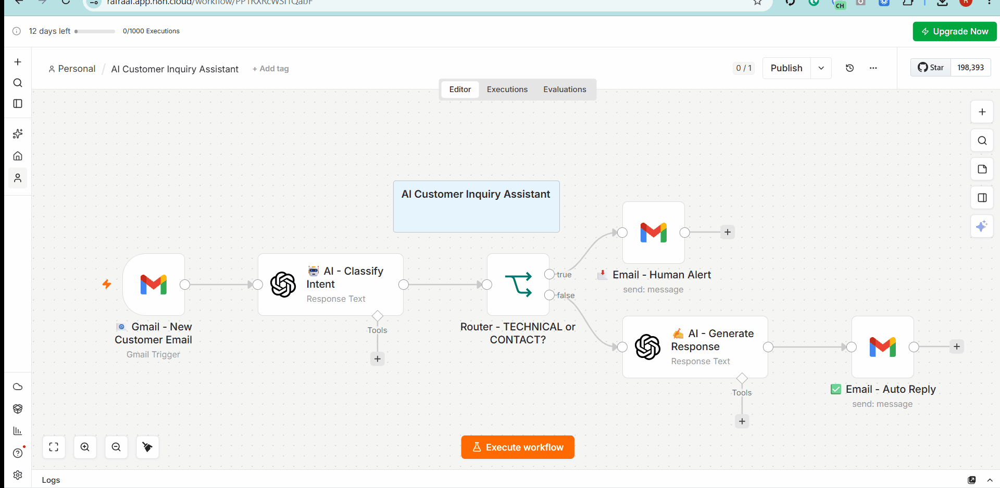
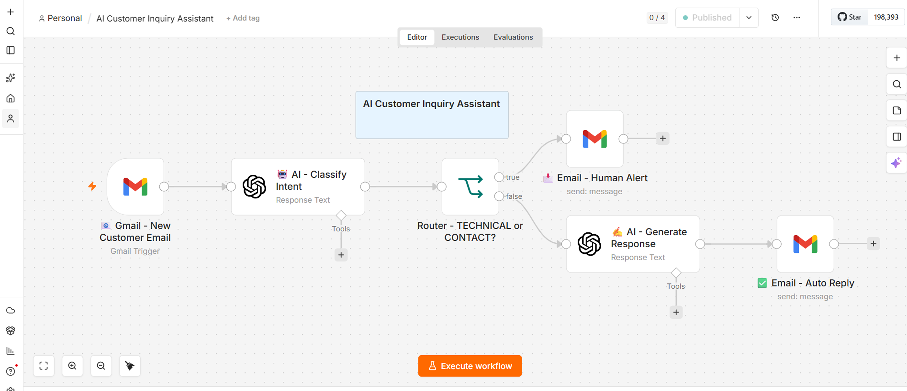
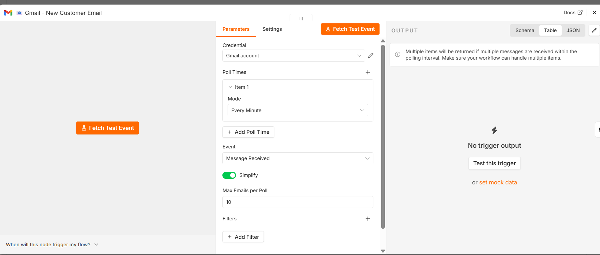
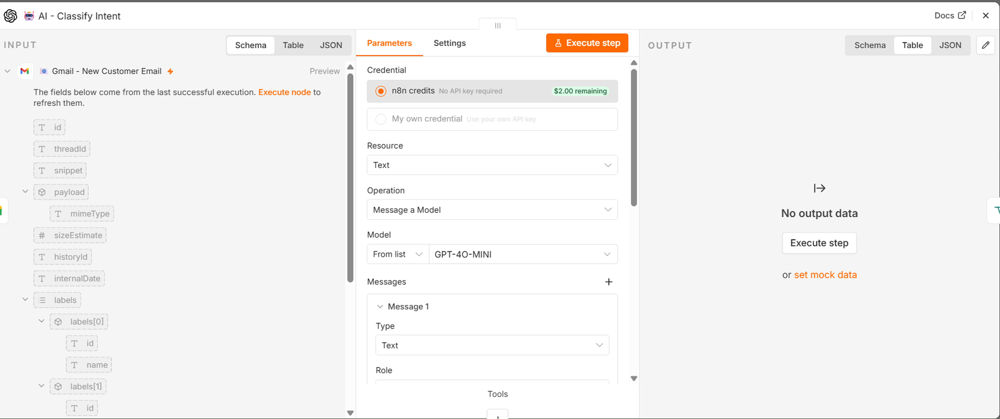
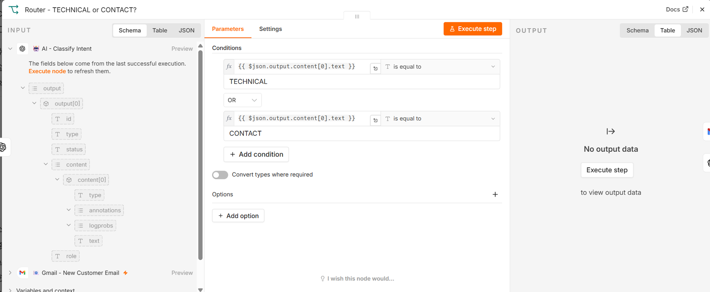
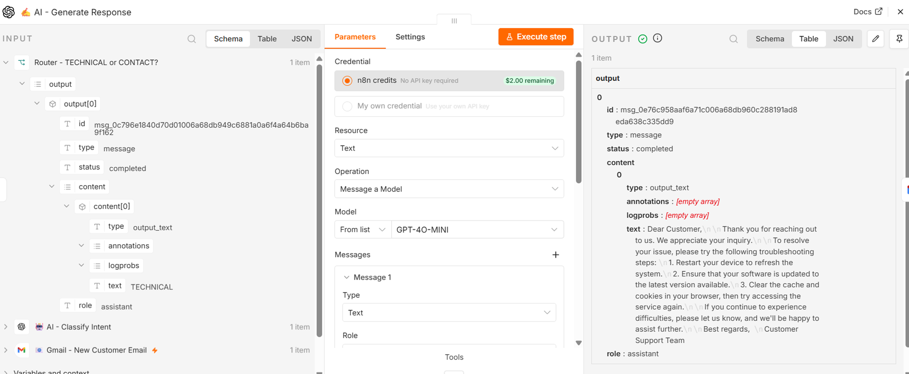
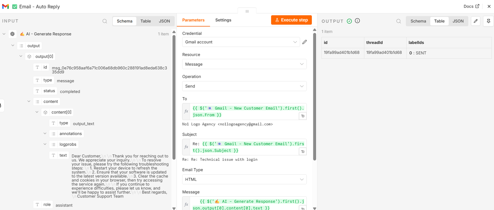
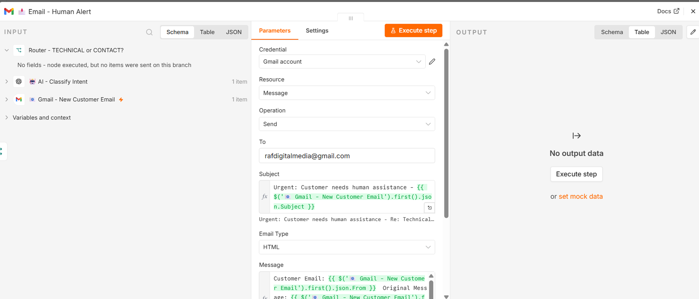
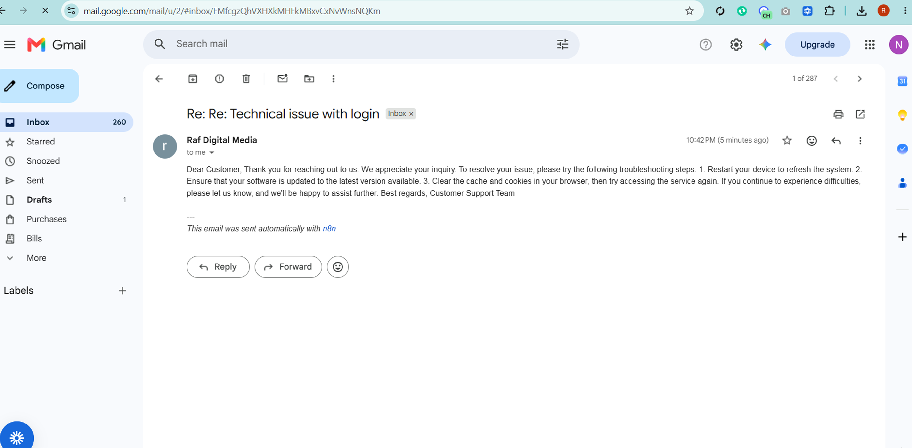

# 🤖 AI Customer Inquiry Assistant

> An intelligent email automation that classifies customer inquiries, generates AI responses, and routes complex issues to human agents — reducing response time by 95%.

---

## 🎬 See It In Action

---

## ✨ Features

- 🤖 **AI-Powered Intent Classification** — Automatically categorizes incoming emails as TECHNICAL, CONTACT, PRICING, or GENERAL.

-  **Smart Auto-Reply** — AI generates contextual, professional, and plain-text responses for general inquiries instantly.

- 🔔 **Human Escalation** — Instant email alerts to the support team for TECHNICAL and CONTACT issues requiring human intervention.

- 🧠 **Intelligent Routing** — Conditional logic (IF Node) seamlessly routes emails to the appropriate handler.

- ⚡ **Real-time Processing** — Under 60 seconds from email receipt to response or alert.

- 📝 **Clean Formatting** — Strict prompt rules ensure no markdown artifacts or placeholders leak into customer emails.

---

## ️ Tech Stack

| Tool | Purpose |
|------|---------|
| **n8n** | Workflow automation engine |
| **OpenAI API** | Email intent classification and response generation |
| **Gmail API** | Email trigger monitoring and automated sending |
| **n8n Expressions** | Dynamic data mapping and conditional routing |

---

##  Business Impact

| Metric | Before | After |
|--------|--------|-------|
| Response time | 2-24 hours | < 60 seconds |
| Manual email handling | 100% | ~30% (only technical/contact) |
| Auto-reply rate | 0% | 70% of general inquiries |
| Customer satisfaction | Variable | Consistent, immediate, and professional |

---

## 🚀 How It Works
Gmail Trigger (New Email Received)
↓
AI Classify Intent (TECHNICAL / CONTACT / PRICING / GENERAL)
↓
IF Router (Is it TECHNICAL or CONTACT?)
↓ ↓
TRUE FALSE
↓ ↓
Human Alert AI Generate Response
(Email) ↓
Auto Reply (Email)

---

## 📸 Screenshots

### Full Workflow

### Gmail Trigger Configuration

### AI Intent Classification

### Smart Routing Logic

### AI Response Generation

### Auto-Reply Configuration

### Human Alert Setup

### Auto-Reply Received in Inbox

---

## 📦 Installation

1. **Import Workflow** — Import `ai-customer-inquiry-assistant.json` to your n8n instance.

2. **Configure Gmail** — Set up Gmail credentials for both the trigger and sending nodes.

3. **Set OpenAI API Key** — Add your OpenAI API key in the n8n credentials section.

4. **Customize Prompts** — Modify the classification prompt in the "AI - Classify Intent" node based on your business categories.

5. **Update Alert Email** — Change the "To" email address in the "Email - Human Alert" node to your support team's email.

6. **Activate & Test** — Activate the workflow and send a test email to your monitored Gmail account!

---

## 💼 Use Cases

- 🎫 **Customer Support** — Auto-respond to common FAQs and general inquiries.

- 💼 **Sales Teams** — Automatically route pricing and upgrade questions to sales.

- 🔧 **Technical Support** — Instantly escalate complex login or bug issues to human agents.

- 📞 **Contact Requests** — Forward partnership or collaboration emails to the right department.

- 🌐 **Agencies & Freelancers** — Maintain a professional, 24/7 responsive image for clients.

---

##  License

MIT License — free to use and modify for personal or commercial projects.

---

**Built with ❤️ using n8n and OpenAI**

*For inquiries or custom automation projects, feel free to reach out!*
